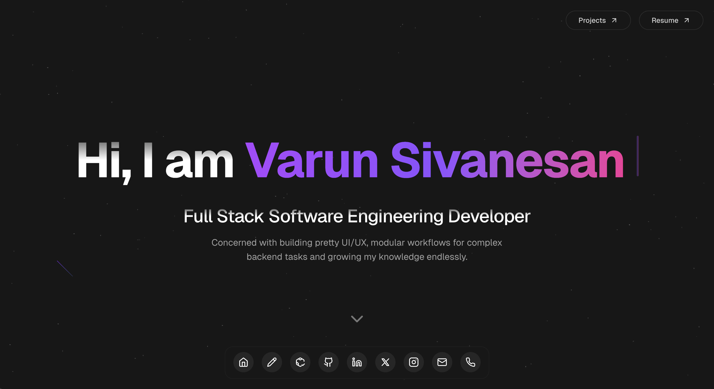
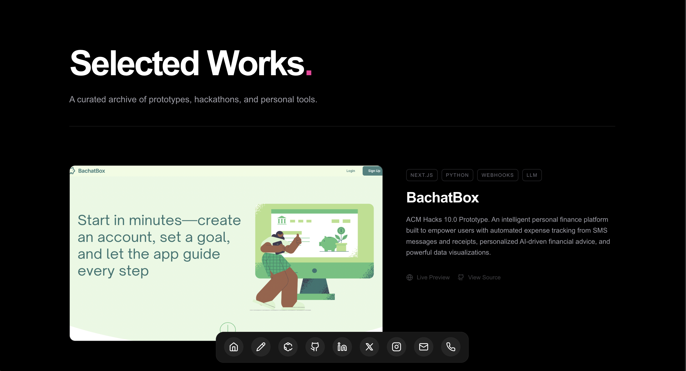
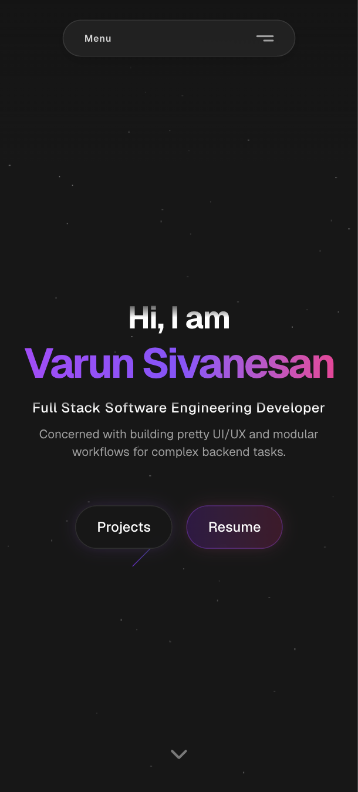
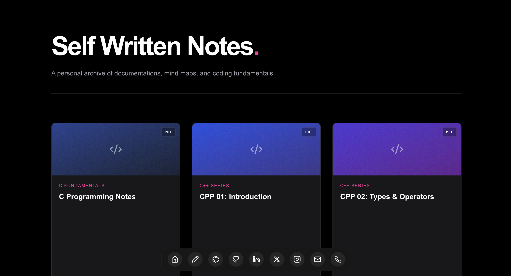
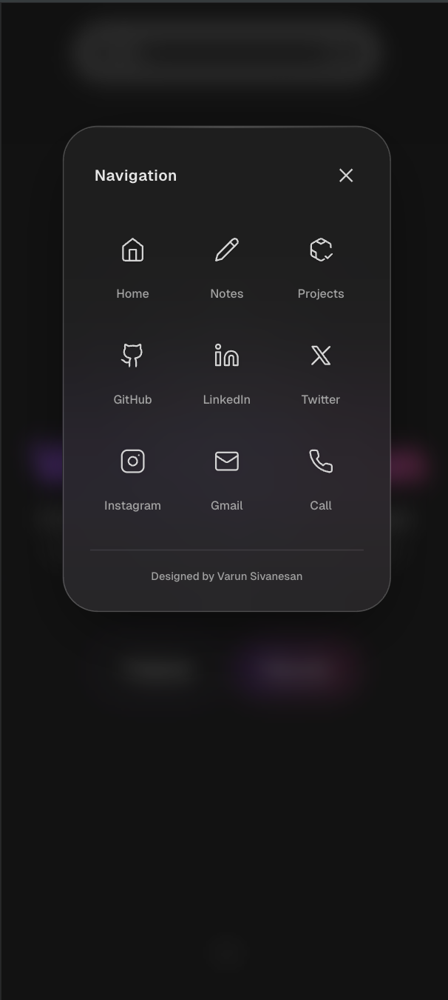

# 🌌 Varun Sivanesan - Portfolio


> A highly interactive, cosmic-themed personal portfolio and digital garden built with Next.js, Framer Motion, and Tailwind CSS.

## 🚀 Overview

This portfolio serves as a central hub for my **Projects** (prototypes & hackathons), **Notes** (PDF library for C/C++/ML), and personal lore. It features a **cosmic/space theme** with shooting stars, dynamic backgrounds, and fluid animations.

The architecture is split into distinct **Desktop** and **Mobile** experiences to ensure optimized performance and layout for every device.

## ✨ Key Features

* **🎭 "Curtain" Transitions:** A custom-engineered routing system. Navigating between major sections (Projects ↔ Notes) triggers a rapid **0.1s white curtain wipe**, providing a snappy, native-app feel.
* **🌌 Atmospheric UI:** Canvas-based Shooting Stars, Star Backgrounds, and Glassmorphism effects.
* **🍎 Floating Dock:** macOS-inspired interactive navigation that scales on hover.
* **📱 "Liquid Glass" Mobile Menu:** A custom mobile drawer with a notch-style trigger.
* **📚 Digital Notes Library:** Integrated PDF viewer for reading handwritten engineering notes directly in the browser.
* **🎮 Personal Touch:** Dedicated sections for League of Legends lore and personal statistics.

## 🛠️ Tech Stack


## 📸 Gallery

### 🖥️ Desktop Experience
| **Home Dashboard** | **Project Showcase** |
|:---:|:---:|
|  |  |

### 📱 Mobile & Details
| **Mobile View** | **Notes Library** |
|:---:|:---:|
|  |  |

### 🎨 UI Details
| **Glassmorphism Navigation** |
|:---:|
|  |

## 📂 Project Structure

Based on the actual architecture of the repository:

```bash
├── app/
│   ├── notes/
│   │   └── page.tsx          # Notes Library & PDF Viewer
│   ├── portfolio/
│   │   └── page.tsx          # Alternate/Draft Portfolio view
│   ├── projects/
│   │   └── page.tsx          # Projects Showcase Grid
│   ├── reference/
│   │   └── page.tsx          # Reference/Test components
│   ├── desktop.tsx           # Main Desktop Layout & Logic
│   ├── mobileview.tsx        # Dedicated Mobile Layout & Menu
│   ├── layout.tsx            # Root Layout
│   ├── page.tsx              # Smart Switcher (Detects device width)
│   └── globals.css           # Tailwind & Global Styles
├── components/               # Shared UI Components (Cards, Buttons)
├── data/                     # Static data files
├── lib/                      # Utility functions (cn, merge)
├── public/                   # Static Assets
│   ├── aphe.jpg
│   ├── home-desktop.png
│   ├── mobile.png
│   ├── notes.png
│   ├── projects.png
│   ├── resume.pdf
│   └── ... (PDFs & Images)
└── ...